# Linear v2 — shell + skin

v1 was a paint job: `linear-theme.css` re-coloured every selector the pages
already had, and left the layout alone. v2 adds the layout. The site now reads
as a Linear-school product surface — a nav-only rail, a 48px top bar, a view
header of tabs, content that fills the rest of the rectangle, and ⌘K.

Nothing in this change touches content, and nothing rebinds an existing handler.

---

## 1 · What actually changed

| File | Change |
|---|---|
| `linear-theme.css` | Evolved in place. Still `@import url('draft-theme.css')` + overrides. Sections 01–22 retuned, 23–31 new (shell, rail, palette, density, marketing, responsive, accent audit, contrast fixes). |
| `linear-layout.js` | **New.** Mounts the shell, the rail collapse, the view header, and the ⌘K palette. |
| `tools/theme_switch.py` | Knows about the layout script: it goes in the same `DRAFT-THEME` block, and `status` now flags a page whose block is missing it. |
| `*.html` (20 pages) | Exactly **one** added line each: `<script src="linear-layout.js" defer></script>`, inside the existing block. Zero content lines. |
| `docs/linear-v2/*.jpg` | Before/after screenshots (§6). |

`git diff main --stat` on the HTML is 20 files, 20 insertions, 0 deletions.

### Why the script is in `<head>`, not before `</body>`

The brief asked for a one-line addition at `</body>`. It is at `</head>` instead,
`defer`red, immediately after `draft.js`. Three reasons, and the outcome is
identical:

* `defer` scripts run after parsing, in document order — so `linear-layout.js`
  still sees a fully-built DOM, and still runs *after* `draft.js` (which strips
  the emoji off the nav labels the rail then puts icons on).
* It keeps the whole enhancement in **one contiguous block**, which is what makes
  `theme_switch.py off` a single regex and the rollback byte-identical.
* One insertion point means one place for drift to hide, and `status` already
  watches it.

---

## 2 · The accent decision (§3.1)

**Vitalite Red.** `#DC2626` on white (4.83:1), lifted to `#F03E3E` on near-black
(5.18:1). The brand mark is a red V; Linear's lesson is about *scarcity*, not
about indigo.

Red is spent on exactly seven things, and nothing else:

1. the active nav row — a 3px bar at the rail's edge, plus the row's icon
2. the active tab's underline
3. the focus ring, and a focused input's border
4. links and link-like actions
5. the one primary CTA per surface
6. progress fills and the reading bar (position — "where you are")
7. `::selection`

Section 30 of the stylesheet is the audit that got it there. It neutralises
every place the earlier layers spent the accent on decoration: the section
eyebrow, the `TEST PREP` tag, the accordion rule and chevron, the numbered
step chips, active filter chips, the study highlight, the account avatar and
level number, the landing headline's red word, the verdict panel's tinted fill.

### The collision, stated plainly

A red brand accent sits in the same hue neighbourhood as the semantic "wrong"
red. This is a real cost of the decision, and it is handled rather than ignored:

* **Semantic states never appear as a fill.** Correct/wrong are a 12% tint on a
  hairline row. The accent, when it fills, fills a button with white text. The
  two never look alike in context.
* **Colour is never the only signal.** `.correct` and `.wrong` each carry a
  glyph (`✓` / `✕`) added in CSS. That is the accessibility requirement anyway.
* **The four-step mastery scale** was re-derived out of the sanctioned semantic
  set — neutral → amber → green outline → green fill — because using the accent
  as one step of a scale would have read as a fifth meaning for red.

If the red ever reads wrong in practice, the fallback is the indigo v1 shipped
(`#5E6AD2` / AA-safe `#5546C9`): change the four `--accent*` values and
`--lin-btn-primary-bg` in sections 01 and 02. Nothing else references a hue.

---

## 3 · The shell

```
┌──────────┬──────────────────────────────────────┐
│ rail     │ top bar (48px)  crumb ··· ⌘K 中 ☾ 👤 │
│ 240px    ├──────────────────────────────────────┤
│ ↔ 56px   │ tabs (36px) · context row (40px)     │
│          ├──────────────────────────────────────┤
│          │ content — edge to edge               │
└──────────┴──────────────────────────────────────┘
```

**Rail.** Navigation only. 32px rows, 13px labels, 16px stroked SVG icons keyed
off the `href` each row already points at (`draft.js` strips the decorative
emoji, so the icon is what carries a row at 56px). Hover 4.5%, active 7% plus
the accent bar. Collapses to a 56px icon rail; the state persists in
`localStorage` under `lin_rail_collapsed`, and the wordmark row becomes the
expand target when collapsed.

**Top bar.** The page's own `<header>`, re-classed and cut to 48px. The drawer
toggle moves into it (it stops being a floating tile). A breadcrumb node is
inserted — on the guide it tracks the visible chapter. `.header-actions` is
untouched except that a `⌘K` button is prepended to it; `#langToggle`,
`#darkToggle` and `#loginBtn` are the same nodes with the same listeners, so
`auth-widget.js` and `sm_user` keep working exactly as before.

**View header.** On the guide this is the chapter strip the page already builds
(`#guideTabs`) — *moved*, not rebuilt, so the page's chapter-switching logic
stays authoritative. Elsewhere it is a four-tab row across the study surfaces.
Under it, a 40px context row: the chapter title and its section count on the
guide, a count elsewhere, and **hidden entirely when it would only repeat the
breadcrumb**.

**Content.** `--max-w` is off on app surfaces; rows run the full rectangle.
The one deliberate exception is long-form prose: `.acc-body-inner > p` and
`.callout p` keep a 78ch measure, because a 1400px line of body copy is not
readable and no amount of Linear discipline makes it so.

---

## 4 · ⌘K

`⌘K` / `Ctrl+K` toggles; `/` opens when the reader is not typing; `Esc` closes
and focus returns to whatever opened it. Arrow keys, Home/End, Enter.

The index is built fresh on every open, from what is actually on the page: the
seven pages, the 13 chapter titles, every `.acc-header` section, plus three
actions (dark mode, EN/中文, sidebar). Matching is substring first, then an
in-order subsequence, so `ch3 card` finds *Ch 3 · Cardiovascular System*.
Every entry is indexed under **both** language strings, so an English query
works while the site is in Chinese and vice versa.

Navigation reuses the page's own handlers rather than reimplementing them:
selecting a chapter clicks `#guideTabs .guide-tab[data-ch=N]`; selecting a
section clicks the `.acc-header` (which runs the page's `toggleAcc`) and then
scrolls. If a node is missing, it falls back to `location.hash`.

---

## 5 · Verification

Driven headless over CDP against a local server, both modes, both languages.

* **Contrast.** An automated WCAG pass over every text node on all seven real
  pages × light/dark × EN/中文, compositing translucent layers properly.
  **0 failures.** Getting there moved four tokens and fixed two page-level bugs:
  * light `--text2` `#5B5E66 → #4E525A`, `--text3` `#787D85 → #646973`
  * dark `--text2` `#9CA0A8 → #ADB2BA`, `--text3` `#7C818A → #8A8F98`
    (both greys now clear 4.5:1 on the *lightest* surface they can land on,
    `--surface4`, not just on the canvas)
  * `exam.html` buttons carrying `style="background:var(--surface2)"` and no
    colour fell back to the UA's black `buttontext` on a near-black fill —
    1.15:1. Folded into the ghost family.
  * the chapter prev/next buttons carry `style="background:var(--accent)"`
    inline; in dark that painted them `#F03E3E`, where the white label is
    3.8:1. Routed through the button token.
* **Overflow.** No horizontal scroll at 375 / 768 / 1440 on any page.
* **Keyboard.** ⌘K opens, `/` opens, arrows move, Enter navigates, Esc closes,
  focus returns. Verified programmatically.
* **Non-interference.** `toggleAcc`, `showFC`, `openAiModal` all still defined
  and callable after mount; chapter switching, deep links and the EN/中文
  toggle all still run through the page's own code.
* **Idempotence.** Injecting `linear-layout.js` a second time produces one
  view header, one ⌘K button, one palette.
* **Reversibility.** `off` → `on` is byte-identical, and `off` reproduces
  exactly the pre-draft bytes of every page. `on` run twice changes nothing.

### One thing that is NOT fixed

Emoji inside *content* strings (button labels like `🏆 Certificate & Progress`,
the AI fab, the `🎬` in resource titles) are still there. They are content, and
content is sacred. Where an emoji is unambiguously chrome — the fab, `.co-ico`,
the feature-card icons — it is desaturated. The rest is a copy edit for whoever
owns the text, not a theme change.

---

## 6 · Before / after

| | before (v1) | after (v2) |
|---|---|---|
| Guide, dark | 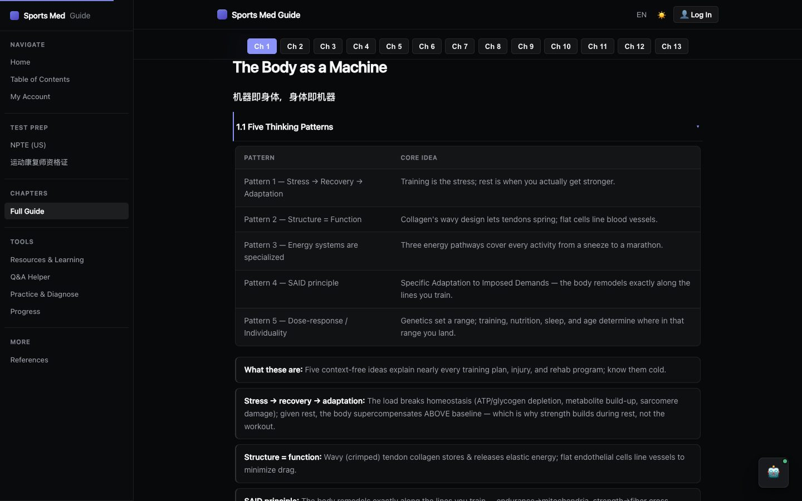 | 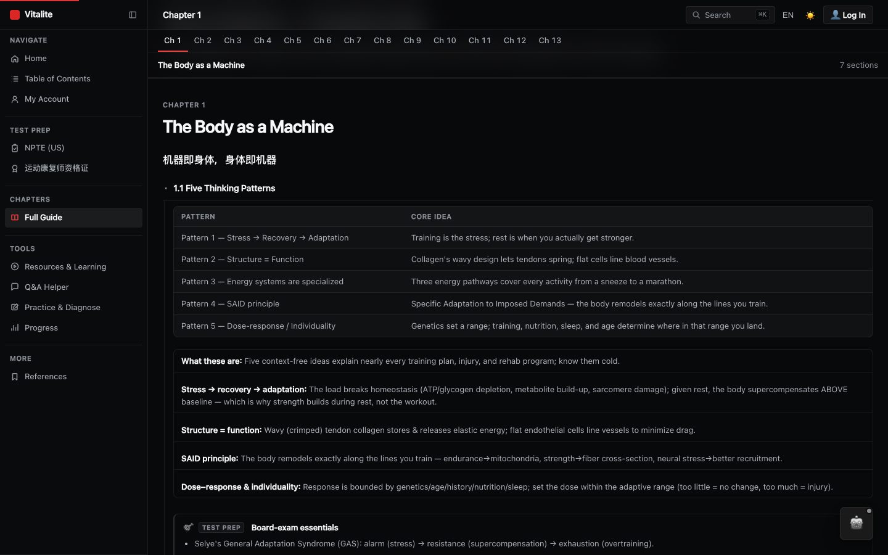 |
| Guide, light | 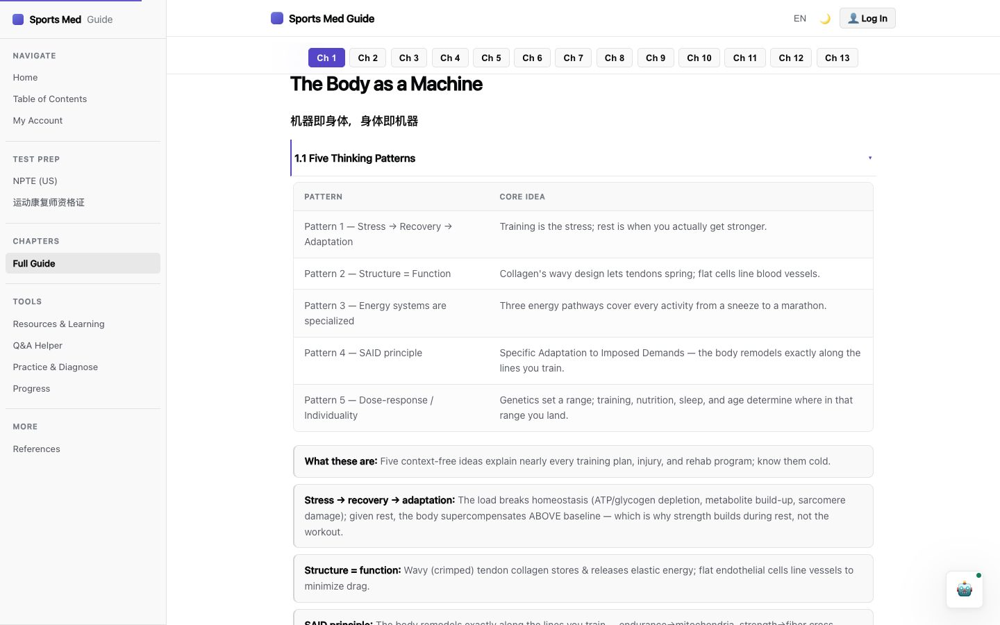 | 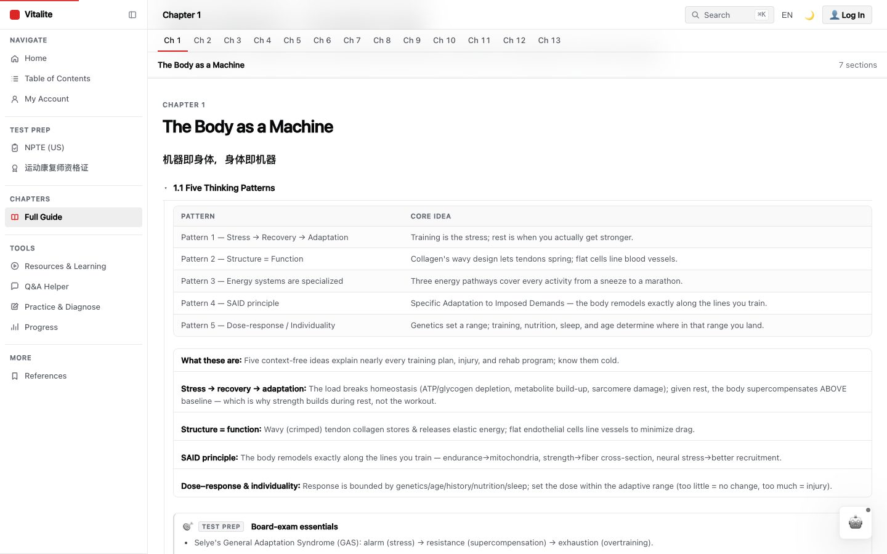 |
| Index, dark |  | 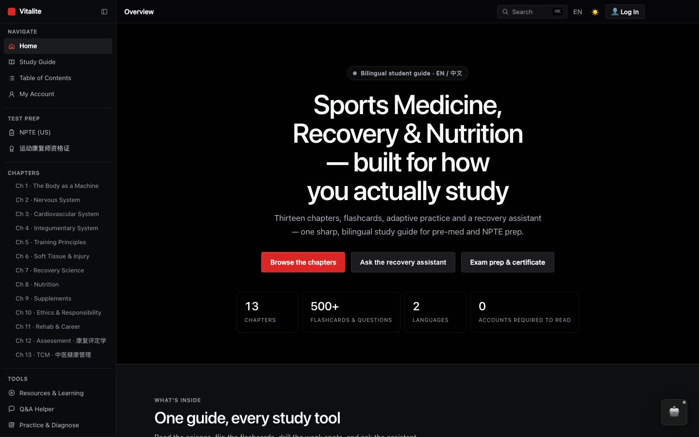 |
| Index, light |  | 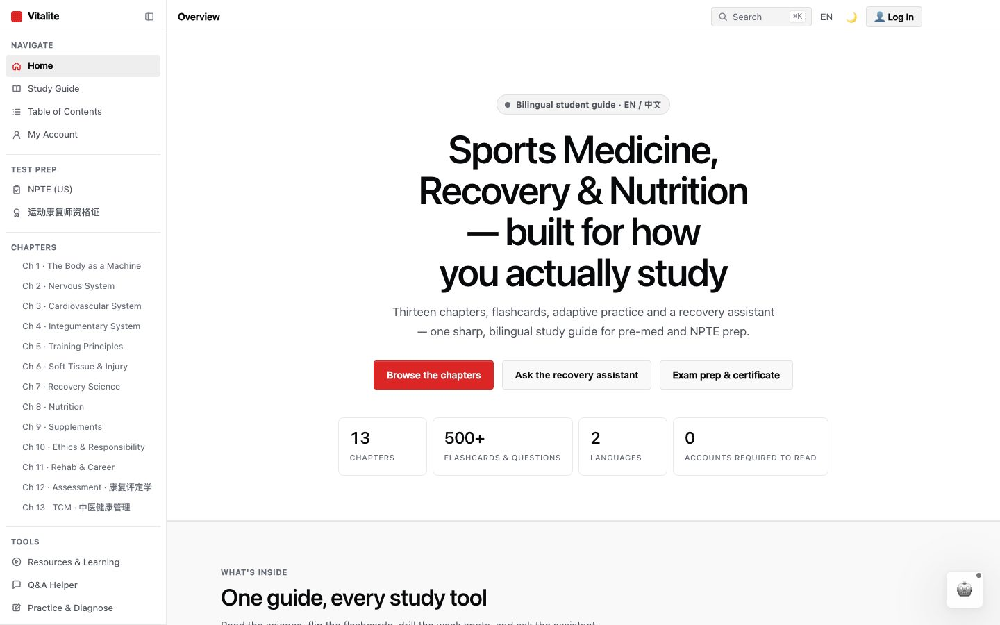 |
| Guide, mobile dark | 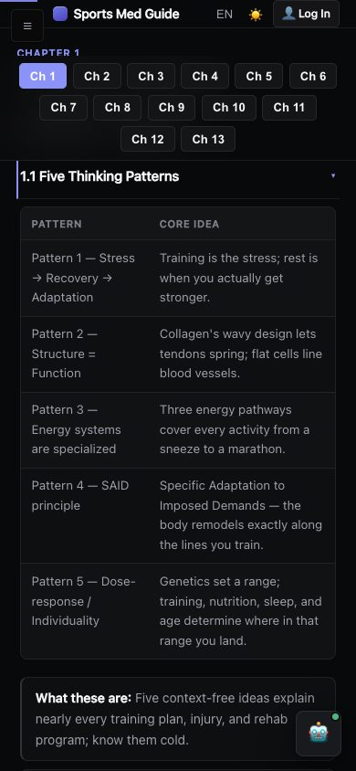 | 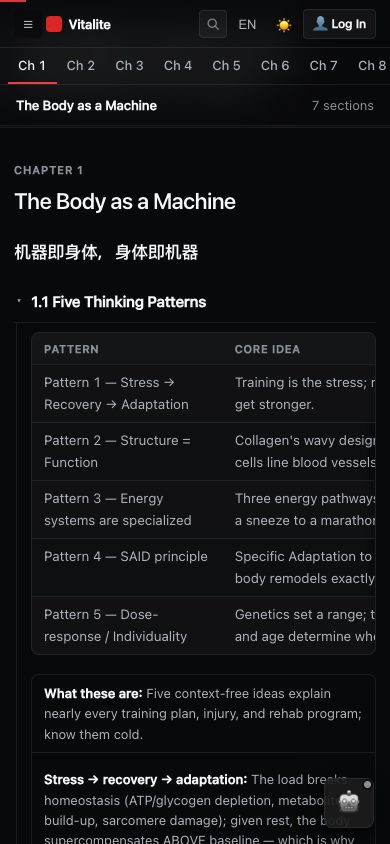 |
| Index, mobile light | 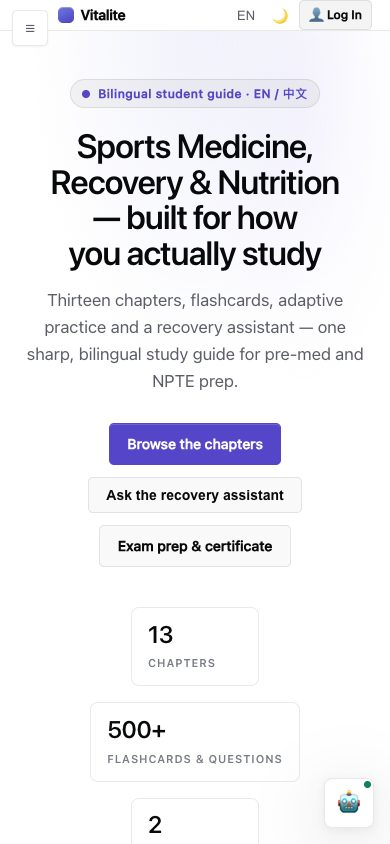 | 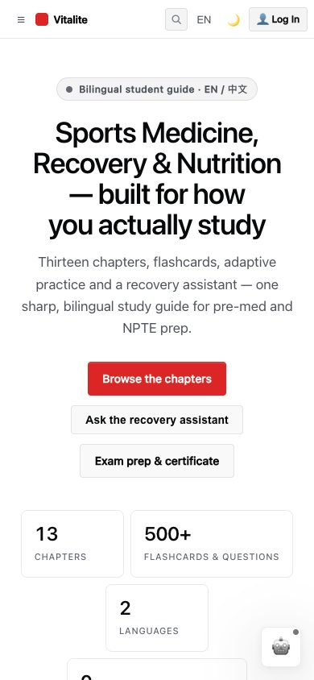 |

New in v2, so there is no "before":

| ⌘K palette | collapsed rail |
|---|---|
| 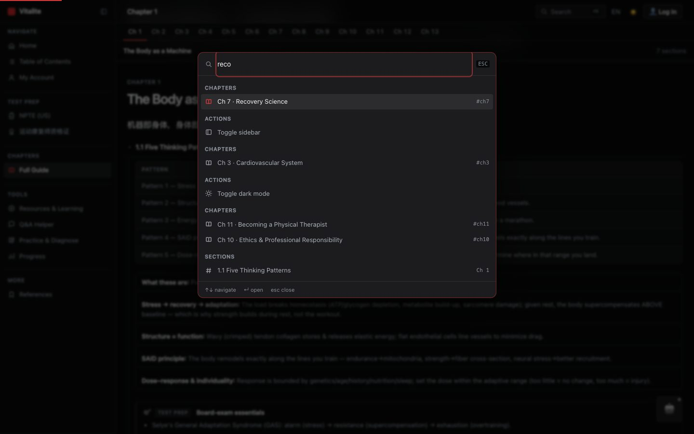 | 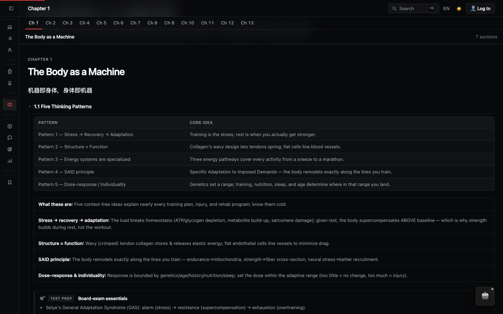 |

---

## 7 · Operating it

```bash
python3 tools/theme_switch.py status   # per page: skin on/off, and drift
python3 tools/theme_switch.py off      # byte-identical strip
python3 tools/theme_switch.py on       # re-apply (idempotent)
```

`status` now reports two kinds of drift, not one:

```
guide.html  ON   (!) links draft-theme.css, not linear-theme.css — run: off then on
guide.html  ON   (!) missing linear-layout.js — run: off then on
```

Run it after **any** edit that touches a page's `<head>`. This has bitten the
repo twice already — a page rewritten from a stale copy keeps the markers, so
`on` sees them, calls the page done, and skips it while production quietly
falls back.

To go back to paint-only, set `LAYOUT_JS = None` in `tools/theme_switch.py` and
re-run `off` then `on`; every `lin-` rule in the stylesheet is gated on
`body.lin-v2`, which only the script sets, so the skin degrades cleanly to v1.
